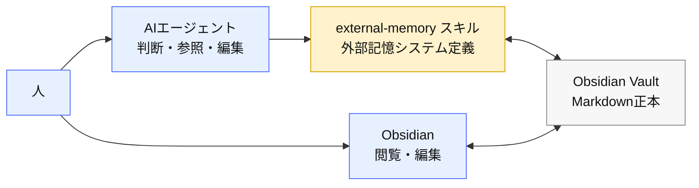
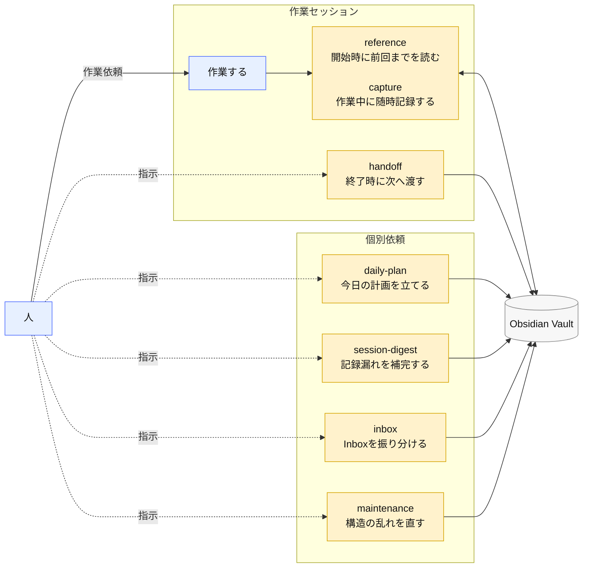
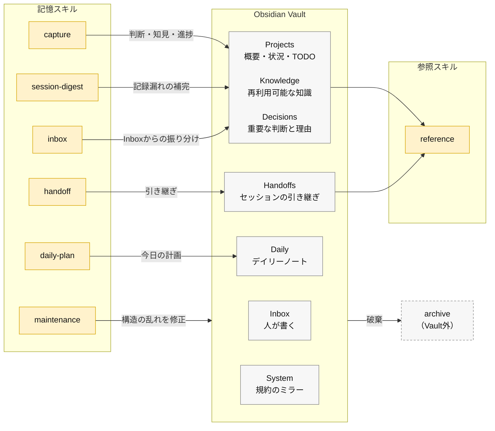

<!-- agent-config: generated mirror — 正本は agent-config リポジトリ vault/Home.md。再同期: ./scripts/sync-vault-mirror.ps1。Obsidian での直接編集は sync で上書きされます。 -->

# Home

## クイックヘルプ

### トリガー早見表

| スキル                           | トリガー                                 |
| -------------------------------- | ---------------------------------------- |
| `external-memory-reference`      | セッション開始時の外部記憶の読み込み     |
| `external-memory-capture`        | 作業中の判断・知見の外部記憶への書き込み |
| `external-memory-handoff`        | 「引き継ぎを作成して」                   |
| `external-memory-daily-plan`     | 「今日の計画を作成して」                 |
| `external-memory-inbox`          | 「Inboxを整理して」                      |
| `external-memory-session-digest` | 「外部記憶の記録漏れを補完して」         |
| `external-memory-maintenance`    | 「外部記憶をメンテナンスして」           |

詳細な運用規約は [[System/external-memory-rules/index|外部記憶ルール]] を参照。

## 仕様概要

青=主体・黄=処理・灰=データを示す。

### 全体アーキテクチャ

外部記憶システムはスキルで定義されており、データはMarkdown（Obsidian Vault）。AIによる読み書きと、Obsidianの利用を両立する。

### 外部記憶システムの流れ

作業セッション内での自律的な記憶の更新・参照と、個別依頼による整備に大別される。

### スキルと記憶領域の対応

記憶領域は性質ごとにKnowledge・Decisions・Projects等を定義しており、記憶スキルで書き、参照スキルで読む。

