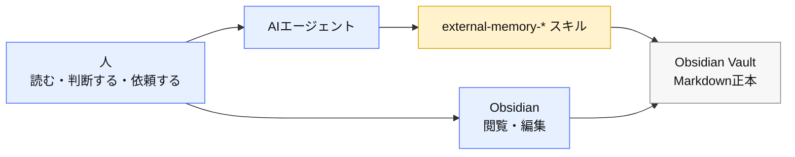
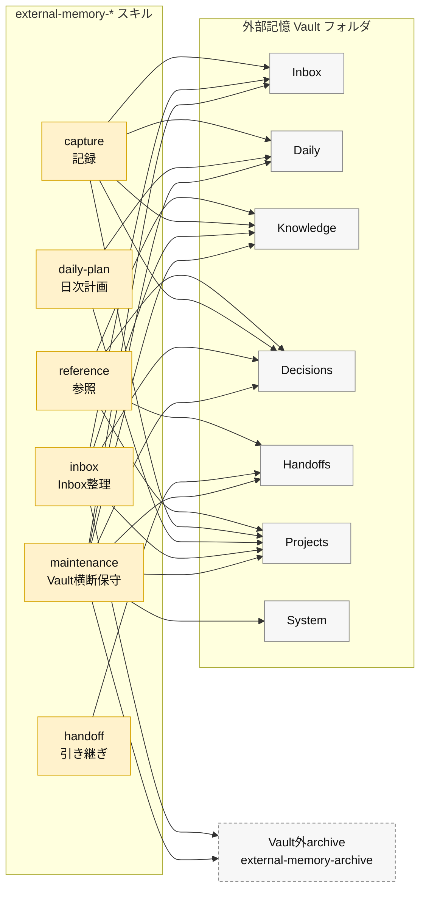
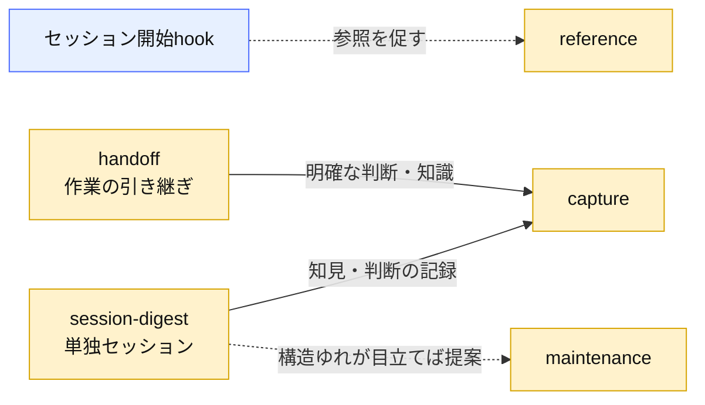
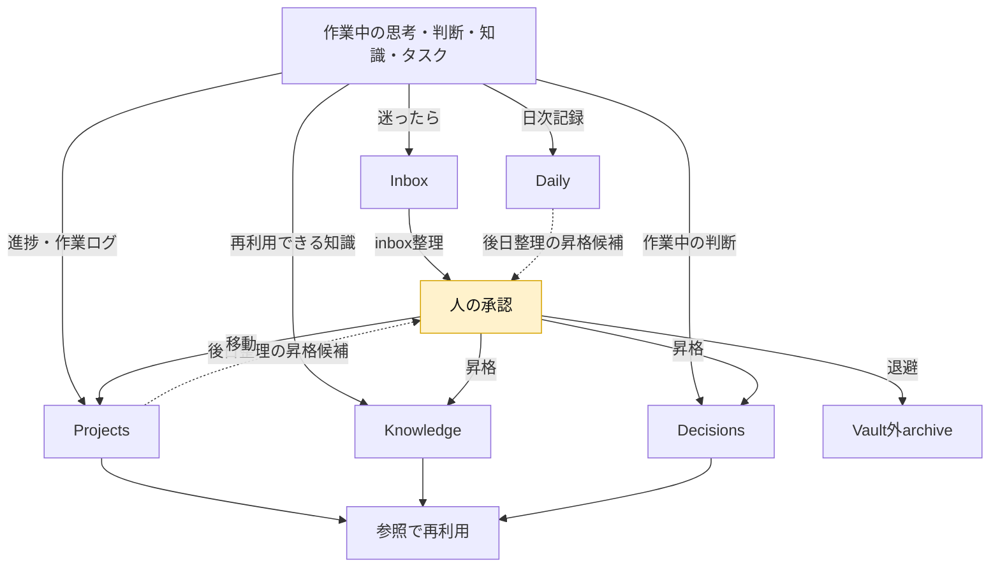

<!-- agent-config: generated mirror — 正本は agent-config リポジトリ vault/Home.md。再同期: ./scripts/sync-vault-mirror.ps1。Obsidian での直接編集は sync で上書きされます。 -->

# Home

## クイックヘルプ

### トリガー早見表

| 言うこと                                       | 動くスキル                       |
| ---------------------------------------------- | -------------------------------- |
| 「このプロジェクトの状態を確認して」           | `external-memory-reference`      |
| 「これを覚えておいて」「買い物に追加」         | `external-memory-capture`        |
| 「今日はここまで。引き継いで」                 | `external-memory-handoff`        |
| 「今日の計画を作って」                         | `external-memory-daily-plan`     |
| 「Inboxを整理して」                            | `external-memory-inbox`          |
| 「セッションを記録して」「記録漏れを確認して」 | `external-memory-session-digest` |
| 「Vaultのリンク切れを直して」                  | `external-memory-maintenance`    |

詳細な運用規約は [[System/external-memory-rules/index|外部記憶ルール]] を参照。

## 仕様概要

### 全体アーキテクチャ

青=主体（人・AIエージェント・Obsidian）／黄=処理（スキル）／灰=データ（Vault）。

### スキルとフォルダ対応

線は各スキルが直接読み書きするフォルダ。スキル間の呼び出しは次の図に分ける。Knowledge / Decisions への後日昇格は、下のデータフローどおり承認後に行う。タスクの正本は文脈ノートか Inbox に置く。System は repo の external-memory-rules のミラーで、maintenance 以外は触らない。

### スキルの呼び出し関係

session-digest は作業セッションの外で単独に走り、記録ロジックを capture へ委譲する。handoff は作業セッション内で引き継ぎを書く。maintenance は呼ばれる側で、Vault の保守は自分で行う。実線=必ず通る委譲、点線=条件付きの提案・促し。

### データフロー

黄=承認ゲート。作業中に明確な判断・知見を直接記録する経路は承認不要。Gateを通るのは、既存ノートから後で切り出す昇格・Inbox整理・移動。

